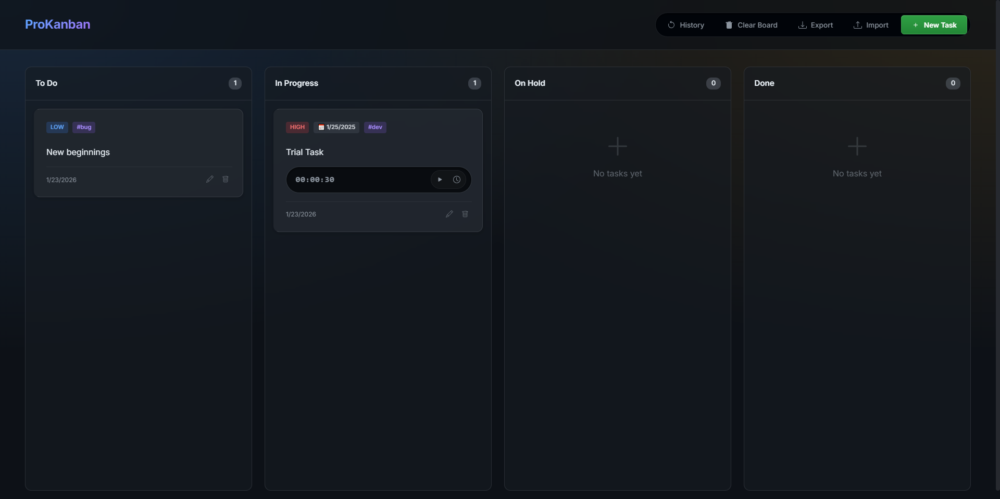

# ProKanban 🚀

ProKanban is a modern, fully responsive **Kanban Board application** built with **Vanilla JavaScript**, **HTML5**, and **modern CSS**.

It helps you manage tasks visually across workflow stages, with advanced features like **drag & drop**, **time tracking**, **activity history**, and **import/export support** — all without any framework.

---

## 🌐 Live Demo

🔗 **Try it here:**  
https://codewithsindhu.github.io/kanban-board-js/

---

## 📸 Preview



---

## ✨ Features  

### ✅ Core Kanban Workflow
- Organize tasks into:
  - **To Do**
  - **In Progress**
  - **On Hold**
  - **Done**
- Smooth **Drag & Drop** task movement
- Task counts updated in real-time

---

### 💾 Persistent Storage
- Automatically saves:
  - Tasks
  - Activity history
  - Timer progress
- Uses browser **LocalStorage**
- Data remains even after refresh or browser restart

---

### ⏱️ Advanced Time Tracking
- Built-in timer per task
- Start/Pause controls directly inside cards
- Automatic timer pause when task moves to:
  - On Hold
  - Done
- Detailed time logs including:
  - Start time
  - End time
  - Session duration
  - Total tracked time

---

### 📜 Activity History Log
- Records every action:
  - Task creation
  - Task movement
  - Deletion
  - Timer events
- Color-coded status indicators for clarity

---

### 📤 Export / 📥 Import Support
- Export full board data as JSON
- Import saved board instantly
- Useful for backups and portability

---

### 📱 Fully Responsive UI
Optimized for all screen sizes:

- **Desktop:** Full 4-column layout  
- **Tablet:** Balanced grid layout  
- **Mobile:** Stacked workflow view  

Touch drag support included for mobile devices.

---

### 🎨 UI Enhancements
- Modern dark glassmorphism theme
- Smooth animations and interactions
- Confetti celebration when tasks reach **Done**

---

## 🛠️ Tech Stack

- **JavaScript (ES6+)**
- **HTML5**
- **CSS3**
  - Flexbox
  - Grid
  - CSS Variables
  - Glassmorphism Design
- **LocalStorage API**

### Libraries Used
- `canvas-confetti` — celebration effects  
- `DragDropTouch` — drag support on touch devices  

---

## 📂 Project Structure

```bash
kanban-board-js/
│── index.html
│── README.md
│── LICENSE
│
└── src/
    │── main.js
    │── style.css
    │
    └── modules/
        │── drag.js
        │── history.js
        │── state.js
        │── storage.js
        │── timer.js
        │── ui.js
